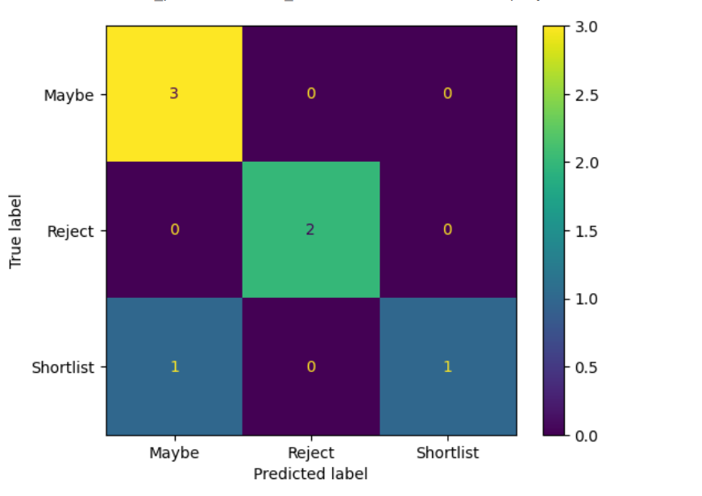

# 🧠 AI Resume Screener

Resume Screener web application that allows HR users to upload multiple resumes, define a Job Description (JD), and automatically rank candidates based on their relevance.

---

Demo video Link - [Demo](https://drive.google.com/file/d/1AUES8tK_gGc4sMgb-em4gp3wzoyENelU/view?usp=sharing)

## Features

### 📄 Resume Upload & Parsing
- Upload multiple PDF resumes at once
- Extract raw text using PDF parsing libraries
- Parse key information:
  - Name
  - Email
  - Phone
  - Skills
  - Education
  - Experience
- Store parsed data in MySQL database

---

### Job Description Input
- Input Job Description via UI
- Extract relevant keywords and required skills

---

### 🤖 ML-Based Matching & Scoring
- Implemented **TF-IDF + Cosine Similarity**
- Computes match score (0–100%) for each resume
- (Optional improvement ready: SBERT for semantic similarity)

---

### Candidate Shortlisting (ML Model)
- Built a dataset of 30+ labeled samples
- Features used:
  - Match Score
  - Years of Experience
  - Skill Count
- Model used:
  - Logistic Regression (Scikit-learn)
- Output:
  - Shortlist
  - Maybe
  - Reject

#### Model Performance
- Accuracy: 86 %
- Confusion Matrix:
- 


## Setup Instructions

###  1. Clone the repository
```bash
git clone https://github.com/your-username/resume-screener.git
cd resume-screener
```

### 2. Backend Setup 
```bash
cd backend
python -m venv venv
source venv/bin/activate
pip install -r requirements.txt
```

### 3. Run the server 

```bash
uvicorn main:app --reload
```

### 4. Frontend Setup

```bash
cd frontend
npm install
npm run dev
```
